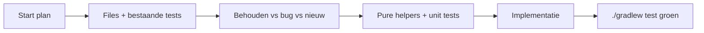

# Uitvoervolgorde

Branch: **WIP-Frozen-scroll-broke**.

## Uitvoeringsafspraak

- Alle plannen **01→10 achter elkaar** uitvoeren (geen wachten tussen plannen tenzij iets blokkeert).
- **Eén git commit per plan** na succesvolle afronding van dat plan (tests groen + scope van dat plan klaar).
- Commit message: kort, “why”, plan-nummer noemen (bijv. `fix(01): InsertReference EDT bib lookup off UI thread`).
- Geen push tenzij expliciet gevraagd.
- Geen commit van secrets / lokale IDE-noise.

**Eén plan tegelijk afronden** (test-gate → code → `./gradlew test` → commit), daarna meteen het volgende.

## Verplichte test-gate

1. Inventariseer geraakte files en tests onder `src/test/kotlin`.
2. **Behouden (correct):** regressie/karakterisatie op bedoelde contracten.
3. **Bugs:** tests op **gewenst** gedrag — **nooit** de bug groen vastzetten.
4. **Nieuw:** tests op nieuwe contracten.
5. UI/Swing/JCEF: bij voorkeur **helpers extraheren** + `./gradlew test`; geen flaky UI-automation. Waar geen zinvolle helper is (bijv. alleen `plugin.xml` volgorde): korte handcheck + bestaande suite groen.
6. Afronden pas als `./gradlew test` groen is.

| Plan | Helper-tests zinvol? |
|------|----------------------|
| 01 | Ja — bib resolve, label parse |
| 02 | Beperkt — toggle-helper indien geëxtraheerd; anders handcheck + suite |
| 03 | Ja — clear-cache temp-dir helper/service |
| 04–05 | Ja — level/indent/filter |
| 06 | Ja — template string asserts (geen autoScrollEditor); settings |
| 07 | Ja — TableGenerator (bestaat, uitbreiden) |
| 08 | Ja — preview cache-key hash; rotate normalize |
| 09 | Ja — resizebox wrap, export body |
| 10 | Ja — undo stack snapshots; origin math |

## Plannen

| # | Plan | Focus |
|---|------|--------|
| **00** | Dit bestand | Index + test-gate |
| **01** | [01_fix_insert_reference_edt](01_fix_insert_reference_edt.plan.md) | EDT bib-walk |
| **02** | [02_editor_popup_menu](02_editor_popup_menu.plan.md) | Context-menu + Preview toggle |
| **03** | [03_refresh_clears_cache](03_refresh_clears_cache.plan.md) | Refresh = clear doc-cache |
| **04** | [04_combo_right_wide](04_combo_right_wide.plan.md) | Combo rechts + breed |
| **05** | [05_combo_indent_filters](05_combo_indent_filters.plan.md) | Indent + filters |
| **06** | [06_remove_autoscroll_editor](06_remove_autoscroll_editor.plan.md) | Auto scroll editor weg |
| **07** | [07_table_wizard_ux](07_table_wizard_ux.plan.md) | Generate Table UX |
| **08** | [08_tikz_toolbar](08_tikz_toolbar.plan.md) | TikZ toolbar: preview/live, rotate, autosave, width %, New-confirm |
| **09** | [09_tikz_export_tex](09_tikz_export_tex.plan.md) | Export/apply/place in TeX + editor Load Last |
| **10** | [10_tikz_canvas_behaviour](10_tikz_canvas_behaviour.plan.md) | Canvas: help, origin, undo/redo |

Oude **partial cherry-pick inventory** en monoliet **08_tikz_canvas_ux** zijn vervallen / opgesplitst.
