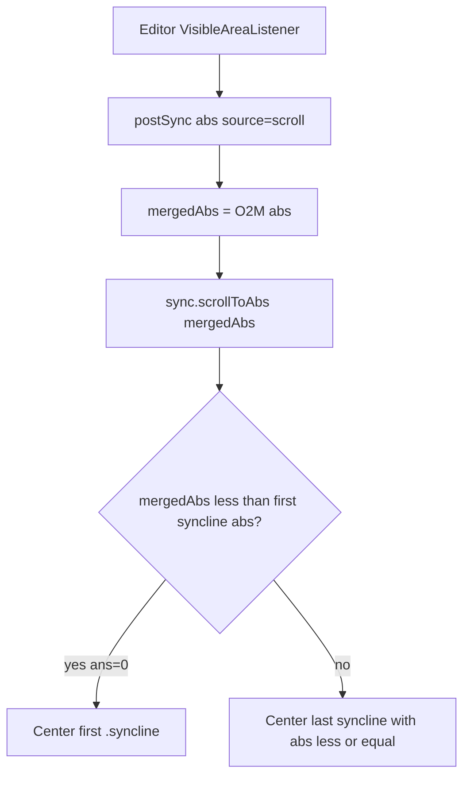

# Plan 11 — Fix editor→preview scroll

Index: nieuw bugfix na [06_remove_autoscroll_editor](06_remove_autoscroll_editor.plan.md). Branch context: **WIP-Frozen-scroll-broke**.

## Diagnose (bevestigd)

Probe-HTML:

| File | synclines | Eerste syncline |
|------|-----------|-----------------|
| SST-34 | 34 | ~**98%** in body HTML (`data-abs` ~181–194) |
| SST-05 | **0** | — (wel ~50 `.llmark`s) |

Logs (`mergedAbs` 30–51, `targetAbs` "194", `scrollY` ~12071): editor in **preamble** → binary search houdt `ans=0` → eerste syncline → die zit na titlepage + grote figures → **jump naar beneden**.

SST-05: continuous path (recente uncommitted change in [`LatexHtmlTemplate.kt`](src/main/kotlin/com/omariskandarani/livelatex/html/LatexHtmlTemplate.kt)) roept alleen `scrollToAbs` aan; lege `idx` → early return → **geen follow**. Oorzaak: [`injectLineAnchors`](src/main/kotlin/com/omariskandarani/livelatex/html/LatexHtmlUtils.kt) telt newlines in **eind-HTML**; titlepage/prose collapse laat bijna geen safe `\n` over in `.full-text`.

`\begin{document}`: SST-34 L193, SST-05 L149 — past bij `targetAbs` 194.

## Doelgedrag

- Editor mouse-scroll / viewport-center blijft preview aansturen (plan 06: editor→preview blijft).
- Preamble / regels vóór eerste body-anchor: preview naar **top** (geen clamp naar late eerste syncline).
- Body-regels: synclines dicht genoeg en op bronregel-`abs`, zodat follow werkt op SST-05/34-achtige papers.
- Discrete jumps (combo/marks) ongewijzigd.

## Aanpak

### 1) Preamble-guard in JS (`scrollToAbs`)

In [`LatexHtmlTemplate.kt`](src/main/kotlin/com/omariskandarani/livelatex/html/LatexHtmlTemplate.kt) `sync.scrollToAbs`:

- Als `arr.length` en `line < arr[0].abs`: `window.scrollTo({ top: 0 })`, debug log, return.
- Nooit meer `ans=0` gebruiken als er geen anchor met `abs <= line` bestaat.

### 2) Source-line syncline markers (structureel)

Nu: anchors ná HTML-collapse → verkeerde/lege densiteit.

Nieuw:

1. Helper `plantSourceLineAnchors(bodyTeX, absOffset)` — vlak na `stripPreamble` + `stripLineComments` in [`LatexHtml.kt`](src/main/kotlin/com/omariskandarani/livelatex/html/LatexHtml.kt) (body heeft nog echte TeX-newlines). Zelfde safe-spot idee als `injectLineAnchors` (niet in `$` / `\[` / math-envs), markeer met token `%%LLA{N}%%` waar `N = absOffset + bodyLine`.
2. Helper `materializeSourceLineAnchors(html)` — eind pipeline: `%%LLA{N}%%` → ``.
3. Bestaande `injectLineAnchors(...)` **vervangen** door materialize (of alleen als fallback als er 0 markers overleefden). Markers moeten prose/titlepage/tikz-stappen overleven; tikz→img mag markers in pictures verliezen (acceptabel).

Belangrijk: `abs` komt van **bronregels**, niet van HTML-newline-index.

### 3) Continuous mark-fallback

In sync-line continuous-tak: na `scrollToAbs`, of binnen `scrollToAbs` als `!idx.length`: binary search op `.llmark` (zelfde als discrete path). Voorkomt dode follow als markers ooit wegvallen.

### 4) Tests (gewenst gedrag; geen bug vastzetten)

- [`EditorPreviewScrollPolicyTest`](src/test/kotlin/com/omariskandarani/livelatex/html/EditorPreviewScrollPolicyTest.kt): assert preamble-guard (`line < arr[0].abs`) + continuous mark-fallback aanwezig in wrapped HTML.
- Nieuwe helper-tests: `plant` + `materialize` roundtrip; abs = `absOffset + line`; markers niet in math.
- Wrap-fixture met `\begin{document}` + body met sections: `syncline`-count **> 0**; eerste syncline-positie **niet** in laatste 50% van body-HTML (karakteriseert SST-34-bug).
- Bestaande `injectLineAnchors_*` tests aanpassen/vervangen waar de API verschuift.

### 5) Test-gate

`./gradlew test` groen (lokale `instrumentCode` file-lock van IDE-sandbox mag opnieuw geprobeerd; geen productfix). Handcheck: SST-34 + SST-05 — start beide top, scroll editor door preamble (preview blijft top), scroll door body (preview volgt).

## Kernfiles

- [`LatexHtmlTemplate.kt`](src/main/kotlin/com/omariskandarani/livelatex/html/LatexHtmlTemplate.kt) — guard + mark-fallback
- [`LatexHtml.kt`](src/main/kotlin/com/omariskandarani/livelatex/html/LatexHtml.kt) — plant/materialize in pipeline
- [`LatexHtmlUtils.kt`](src/main/kotlin/com/omariskandarani/livelatex/html/LatexHtmlUtils.kt) — helpers (naast/i.p.v. `injectLineAnchors`)
- Tests onder `src/test/kotlin/.../html/`

## Niet in scope

- Preview→editor auto-scroll (plan 06 blijft weg)
- O2M multi-file herschrijven
- Probe-`.html` artifacts regenereren (optioneel later)
